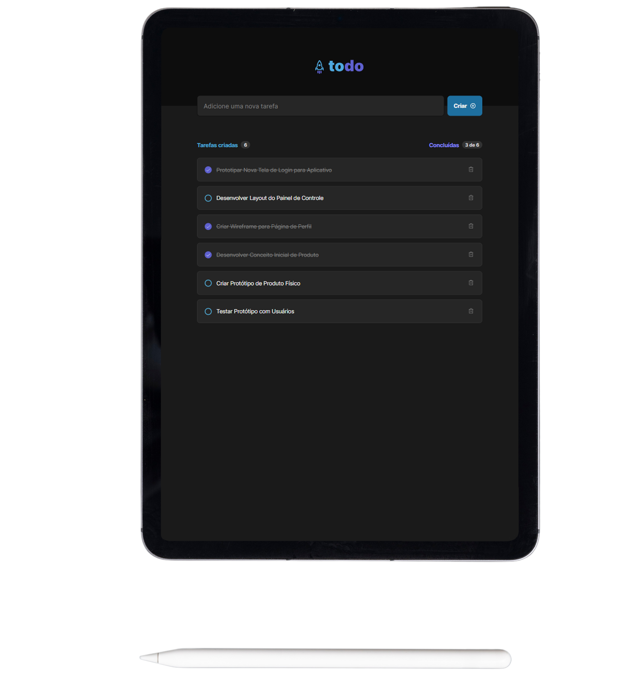

<h1 align="center">
  
</h1>

  
  

 

  

## 🔺 Demo
### [Live Demo, click here](https://todo-list-umber-theta.vercel.app/)

## 📦 Tech Stack

- Vite
- Typescript

[check in package.json](/package.json)

## 🔩 Installation

To install and run the project locally, follow these steps:

1. Install [**Yarn**](https://yarnpkg.com/) on your computer
1. Clone the repository `git clone https://github.com/jhonbergmann/todo-list.git`
1. Navigate to the project directory: `cd todo-list`
1. Install the dependencies: `yarn install`

## ⚙️ Usage

1. Start the development server: `yarn dev`
1. Now access the following url in your browser: `http://localhost:5173`

## 📝 License

[MIT © Jhonatan Bergmann](https://github.com/jhonbergmann/todo-list/blob/main/LICENSE)
